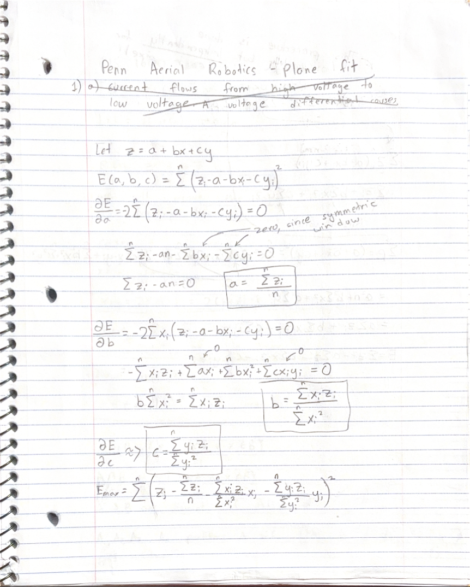
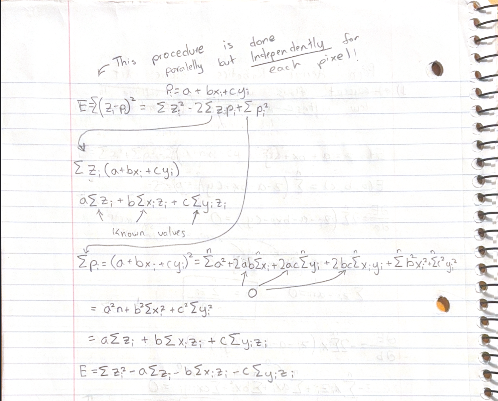
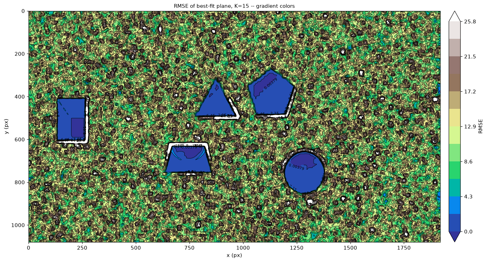
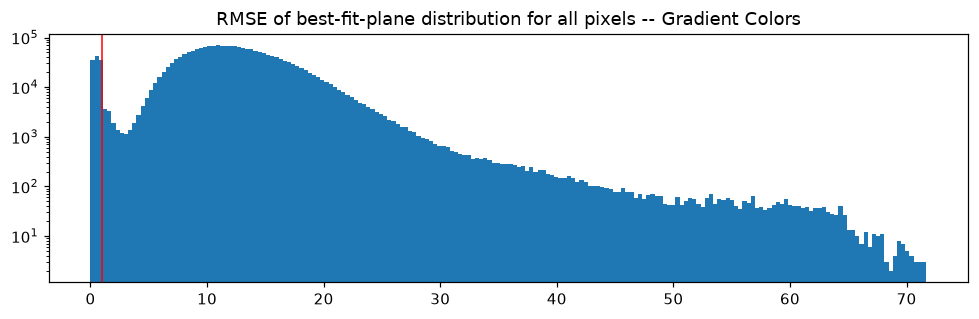
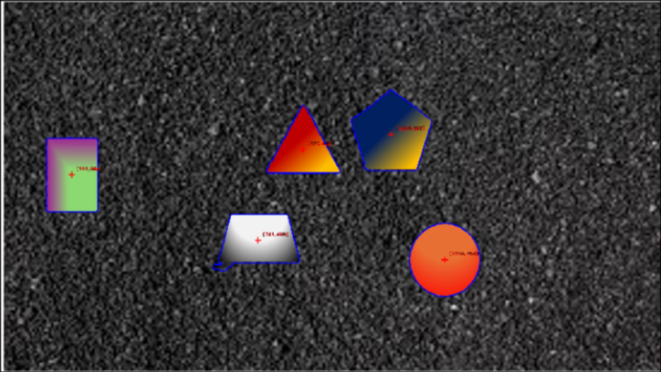
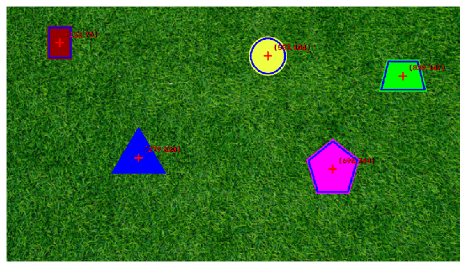

# running the code

there is a makefile that runs the code for this in ROS. you can use `ros2 run pennair_vision viewer` to run a basic viewer app and `ros2 launch pennair_vision pennair_launch.py video_path:="$(VIDEO)"` to run it but lowkey this might not work properly (without claude intervention) since my ROS 2 setup is really weird on arch.

The better way to run is through (after making a venv and installing reqs.txt):
* `python pennair_vision/pennair_vision/main.py VIDEO/IMAGE_FILE_PATH`
* `python pennair_vision/pennair_vision/main.py "/home/taha/Code/clubs/PAiR/PennAir 2024 App Static.png" `

# The process

An image is a function that maps coordinates to RGB values $P(<x, y, z>) = <r, g, b>$.

we want to make a function $F$ s.t. there exists a threshold value $n$ where when $F(x, y, z)<n$, the point $<x, y, z>$ is inside a shape.

initially, for the static image, there are two obvious approaches.
1. color filtering, which just contrasts the shape's color with the background (which is green).
2. texture/local filtering, which checks whether the shape is a flat region or not

approach 1 has some issues with green shapes, so I went with approach 2 in [std_fit.ipynb](std_fit.ipynb). I firstly converted from color to grayscale because it's faster and we're not using color anyways. I used standard deviation from a local pixel neighborhood as $F$, plotted it on a hist, and then used a threshold with a contour drawer to isolate the images and find their centers/coords.

This image shows you the standard deviation around the local neighborhood of each pixel as a grayscale visualizer. The shapes and their thresholds (for the most part), and very easily seen, with it being easier for some shapes than others.

and in video:
[video link](https://drive.google.com/file/d/16XBxv6L8RsT39_hta-NGWyHK2IU3JKqf/view?usp=sharing)

Anyways, this obviously wouldn't work for the hard images. so how to fix? Well, instead of checking for standard deviation, we use a property of continuous functions called `local_lineary`, where if we zoom in enough with a small kernel, the gradient will appear linear. so, instead of trying to "fit" a flat plane and measuring standard deviation in the local area, we can fit and generalize to a plane $z=ax+by+c$ and use RMSE as our function `F`. I did the work out on paper, and this is doable without solving coupled PDEs because since we're using a kernel that is centered at the pixel itself, a lot of the sigma/addition terms cancel each other out, and the remaining computation is do-able with box-sums in $O(n^2)$.

Here is the notebook (w/ my process): [notebook](plane_fit.ipynb)

### Math: 

### Result:

[video link](https://drive.google.com/file/d/1l_Pa-ks21Ftzz2r0M8hgG22BEK93kk9u/view?usp=sharing)

### cool graph/distribution plots

heatmap of RMSE vs. pixel coord:

distrib of RMSE (for figuring out threshold):

### post processing

in this image, you can see that there is a blurb going out of the rectangle.

also, before dilation, the contours were inside the rectangle by a fixed radius (due to the kernel being really sensitive to edges to the point where it wouldn't fit if we touched an edge). However, simply expanding the contour would completely brick the system.

example:

to fix, used these three steps:
* i used minkowski's algorithm (imagine rotating a circle across the edge of the contour and expanding it by a fixed radius). 
* to cover up any bad expanding blurbs outside the center and to prevent the model from  "overfitting" into the smaller white background specs, I filtered out all contours whose areas are <= k.
* and finally, I smoothed out the edges by doing a 9x9 erode than dilate operation. This pulls all of the waviness and weird blurbs out of the shape, and then simply re-expand the shape again. 

# 3d/perspective

this was pretty cool. I did some math (and was helped my prof g randomly in towne) to understand cameras and perspective. the equations after derivation from the intrinsic matrix were really trivial because no skew.

* deriving the equations for $x_o$ and $y_o$ from $x_i$ and $y_i$ (and constant $z_i, z_o$):

* deriving those same formulae a different way with the pinhole camera equation (through some indian guy on youtube)

# ros 2

this was interesting. I had to use a virtual environment called mamba to set it up. and it didn't work for like 2 hours, but claude is great. 

I made three topics, `image_annotated`, and `image_raw`. the detector ran on `image_raw` and published to `image_annotated` which the viewer looked at. the nodes are three, a streamer, detector, and viewer.

`video_publisher  --image_raw-->  detector  --image_annotated-->  viewer`.

so yeah if u look at my makefile it's really hood. like theres 3 venvs I need to configure properly or smth.

# final notes

this solution is p cool, but obviously, this only really does work on textured backgrounds with gradient/flat shapes. if the background was smooth, an ACTUAL alg like CANNY for edge detection would be better.