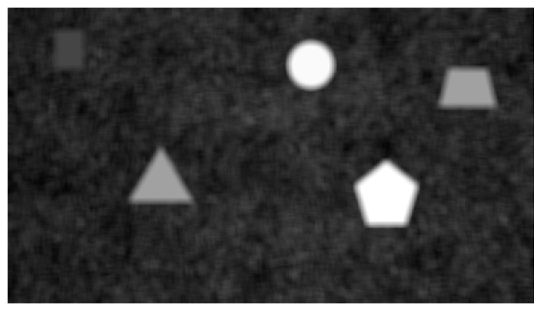
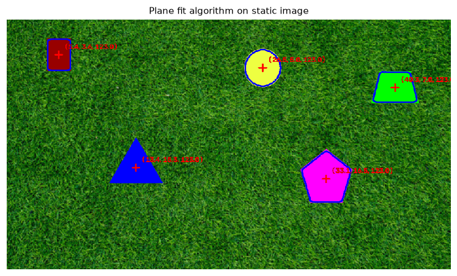
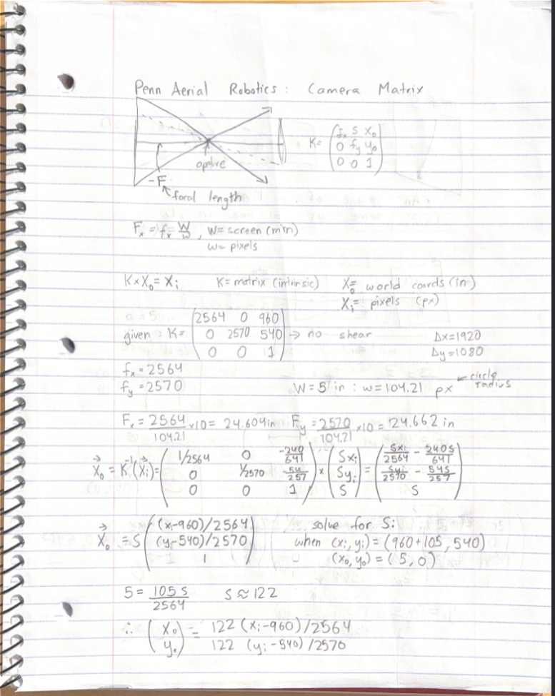
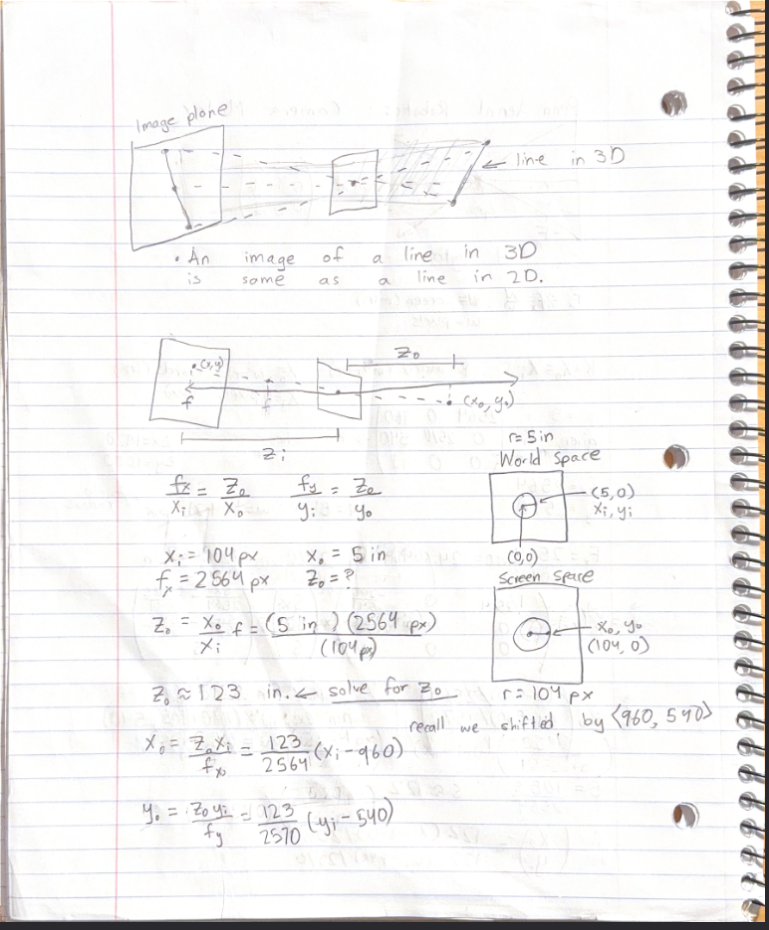

# running the code

there is a makefile that runs the code for this in ROS. you can use `ros2 run pennair_vision viewer` to run a basic viewer app and `ros2 launch pennair_vision pennair_launch.py video_path:="$(VIDEO)"` to run it but lowkey this might not work properly (without claude intervention) since my ROS 2 setup is really weird on arch.

The better way to run is through (after making a venv and installing reqs.txt):
* `python pennair_vision/pennair_vision/main.py VIDEO/IMAGE_FILE_PATH`
* `python pennair_vision/pennair_vision/main.py "/home/taha/Code/clubs/PAiR/PennAir 2024 App Static.png" `

# The process

An image is a function that maps coordinates to RGB values $P(<x, y, z>) = <r, g, b>$.

we want to make a function $F$ s.t. there exists a threshold value $n$ where when $F(x, y, z)<n$, the point $<x, y, z>$ is inside a shape.

initially, for the static image, there are two obvious approaches.
1. color filtering, which just contrasts the shape's color with the background (which is green).
2. texture/local filtering, which checks whether the shape is a flat region or not

approach 1 has some issues with green shapes, so I went with approach 2 in [std_fit.ipynb](std_fit.ipynb). I firstly converted from color to grayscale because it's faster and we're not using color anyways. I used standard deviation from a local pixel neighborhood as $F$, plotted it on a hist, and then used a threshold with a contour drawer to isolate the images and find their centers/coords.

This image shows you the standard deviation around the local neighborhood of each pixel as a grayscale visualizer. The shapes and their thresholds (for the most part), and very easily seen, with it being easier for some shapes than others.

and in video:
<video width="640" height="360" controls>
  <source src="outputs/PennAir_Video_Easy.mp4" type="video/mp4">
  Your browser does not support the video tag.
</video>

Anyways, this obviously wouldn't work for the hard images. so how to fix?

# 3d/perspective

this was pretty cool. I did some math (and was helped my prof g randomly in towne) to understand cameras and perspective. the equations after derivation from the intrinsic matrix were really trivial because no skew.

* deriving the equations for $x_o$ and $y_o$ from $x_i$ and $y_i$ (and constant $z_i, z_o$):

* deriving those same formulae a different way with the pinhole camera equation (through some indian guy on youtube)

# ros 2

this was interesting. I had to use a virtual environment called mamba to set it up. and it didn't work for like 2 hours, but claude is great. 

I made three topics, `detections`, `image_annotated`, and `image_raw`. the detector ran on `image_raw` and published to `image_annotated`